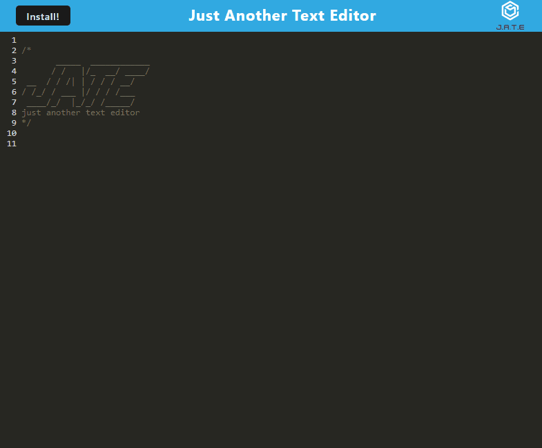

# Text-Editor

## Description

A text editor that can be run in the browser. A single-page application that meets PWA (Progressive Web Application) criteria. Code repository can be found [here](https://github.com/Swagnarok630/Text-Editor).

## Table of Contents

* [Criteria](#criteria)
* [Installation](#installation)
* [Usage](#usage)
* [Contributing](#contributing)
* [Tests](#tests)
* [Questions](#questions)
* [Notes](#notes)
* [License](#license)

## Criteria

* Text Editor can be used in the browser
* Text Editor can be installed as PWA
* Text Editor can be used without an internet connection
* Uses IndexedDB with proper routing paths
* Contents automatically saved when DOM is unfocused
* Bundled with webpack
* Uses a service worker with workbox for Caches static assets
* Uses Babel transpiler

## Installation Instructions

No installation needed. The user may use the app as it is deployed [here](https://text-editor-s630.herokuapp.com/)

## Usage

User may use the app once the page is loaded. User may also download the app as a PWA once on the page.

## Contributing

Anyone is welcome to contribute to this project as they see fit, as there can be many more improvements made. Look for my contacts in the upcoming Questions section.

## Tests

No test cases needed.

## Questions

If there are any questions or concerns regarding the app, you may contact me through the following:
* Github - <https://github.com/Swagnarok630>
* E-mail - swagnarok.630@gmail.com

## Notes

### Future Features
* Enlarged the text editing window
* Allow for changable themes for both background and text

## License

Copyright (c) Darryl Le. All rights reserved.  
Licensed under [MIT](https://opensource.org/licenses/MIT) license(s).
